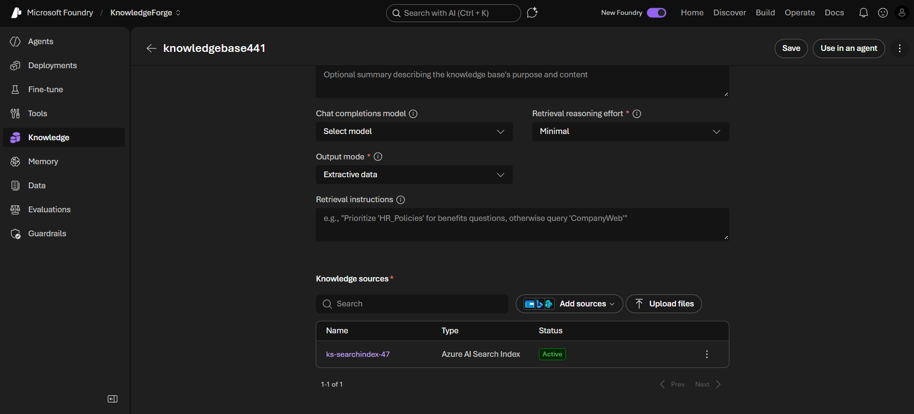
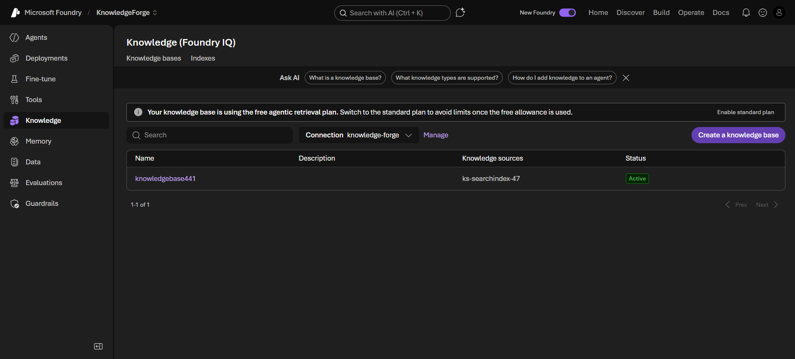
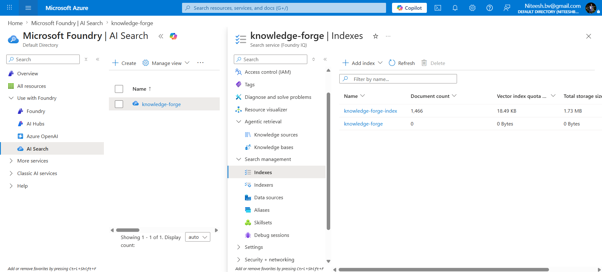
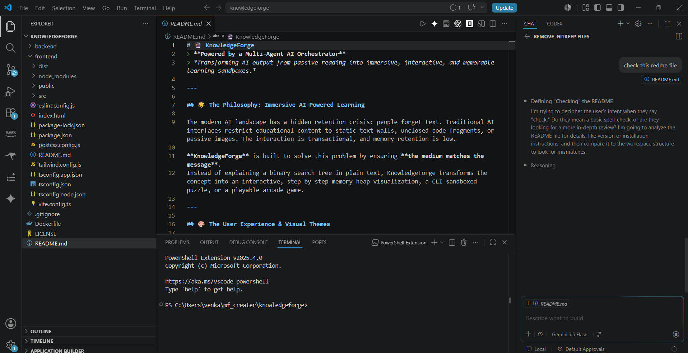
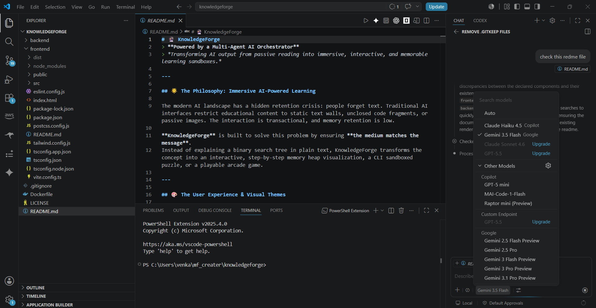

# Proof & Hackathon Details (Agents League Hackathon Details)

## Project Screenshots / Proof

### Foundry IQ Proof Video
[Watch the Proof Video](./frontend/public/videos/20260613-1740-48.4761567.mp4)
<video src="./frontend/public/videos/20260613-1740-48.4761567.mp4" controls width="100%"></video>

## Foundry IQ + Azure AI search Index

## Github Copilot + VS Code
We used GitHub Copilot and VS Code to accelerate the development of our idea, leveraging frontier models.

