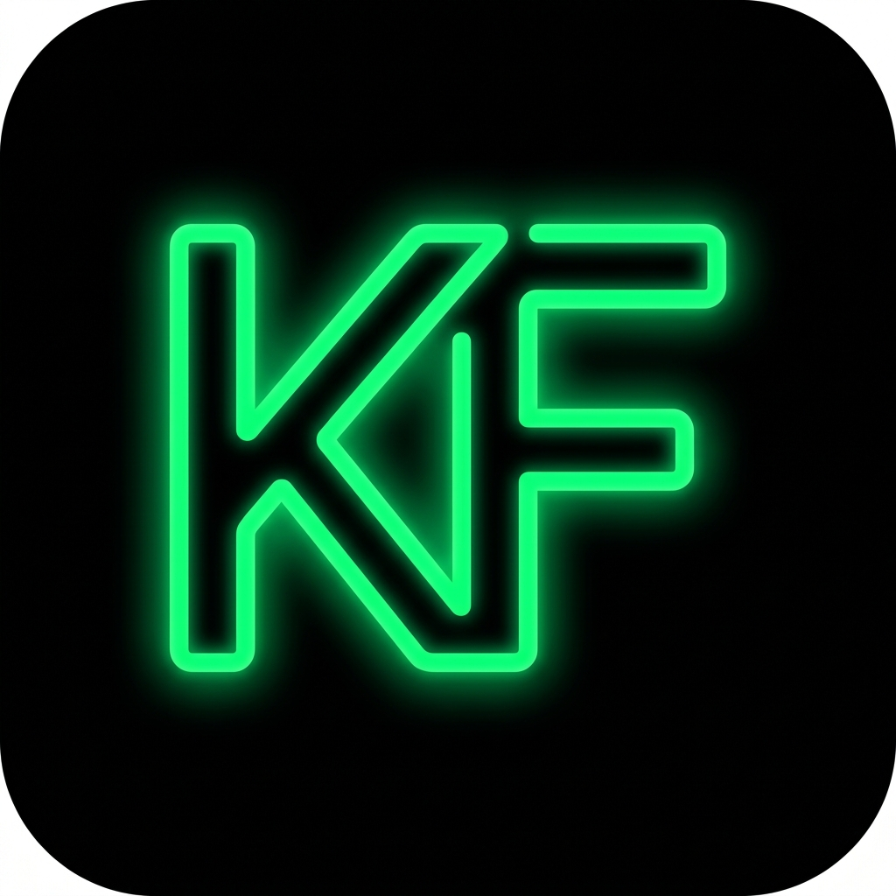
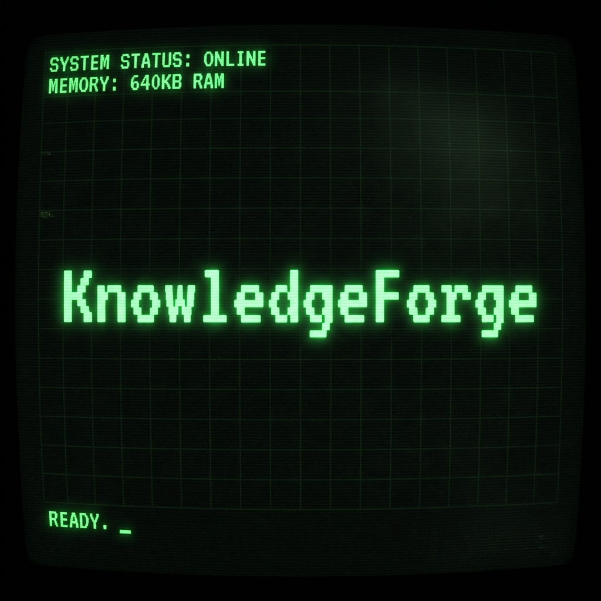
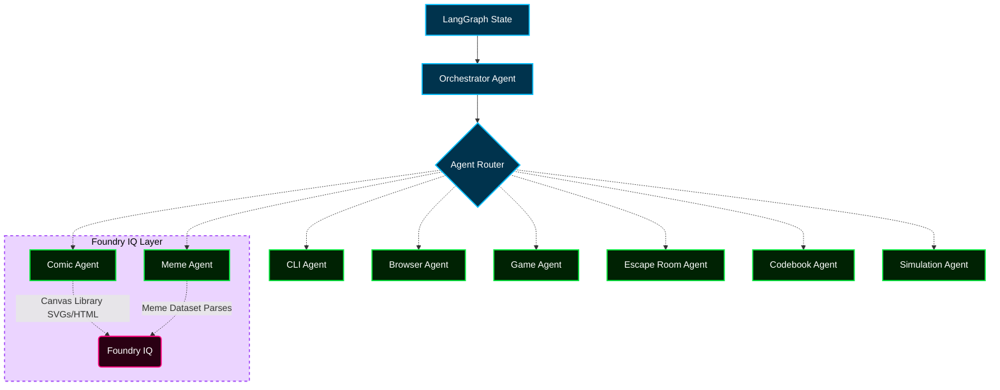

#  KnowledgeForge

<div align="center">
  
</div>

> **Powered by a Multi-Agent AI Orchestrator**  
> *Transforming AI output from passive reading into immersive, interactive, and memorable learning sandboxes.*

**Demo Video:** [Watch on YouTube](https://www.youtube.com/watch?v=8YPDC3mczpY)  
**Technical Writeup:** [Agents League Hackathon Project](https://innovationstudio.microsoft.com/hackathons/Agents-League-Hackathon/project/123257)  
**Live Demo:** [Play KnowledgeForge](https://knowledgeforge-production-064c.up.railway.app/)  
**Developer Email:** [niteesh.bv@gmail.com](mailto:niteesh.bv@gmail.com)

### 📚 Essential Documentation
- 🏗️ **[Architecture Deep Dive](./architecture.md):** Detailed breakdown of our multi-agent architecture and Foundry IQ integration.
- 📸 **[Hackathon Proof & Details](./Proof.md):** Evidence for judges and details of the Agents League submission.
- 💡 **[Prompt Guidance](./guidance.md):** A complete guide on what prompts to ask to explore specific games, visualizers, and interactive features.

---

## 🌟 The Philosophy: Immersive AI-Powered Learning

The modern AI landscape has a hidden retention crisis: people forget text. Traditional AI interfaces restrict educational content to static text walls, unclosed code fragments, or passive images. The interaction is transactional, and memory retention is low.

**KnowledgeForge** is built to solve this problem by ensuring **the medium matches the message**. 
Instead of explaining a binary search tree in plain text, KnowledgeForge transforms the concept into an interactive, step-by-step memory heap visualization, a CLI sandboxed puzzle, or a playable arcade game.

---

## 🎨 The User Experience & Visual Themes

KnowledgeForge is designed with a retro-futuristic aesthetic inspired by vintage computers and early operating systems. 

### Custom Graphics Eras
Users can dynamically switch the entire visual container between three design eras:
*   **💾 1990s Command Line Era:** Heavy terminal styling, mono-spaced font grids, and a flickering **CRT monitor overlay** with scanning scanlines.
*   **💽 2000s Desktop Era:** Clean window borders, nostalgic system title bars, bevels, and early GUI color schemes.
*   **⚡ 2026s Modern Era:** Sleek, borderless dark mode, premium glassmorphism, and responsive gradients.

### Curated Color Palettes
Four retro-themed color palettes are available:
*   **Cyber Green (Default):** Classic matrix-like phosphor terminal glow.
*   **Amber Gold:** Retro mainframe console warmth.
*   **Glitch Blue:** High-tech cybernetic look.
*   **Cyber Rose:** Neon synthwave aesthetic.

---

## 🛠️ Modern Engineering Stack & Architecture Specifications

KnowledgeForge is engineered using a state-of-the-art distributed agentic design, incorporating stateful state machines, hybrid retrieval-augmented generation (RAG), and client-side system virtualization.



### 1. Stateful Multi-Agent Orchestration (LangGraph & LangChain)
At the core of the backend is a stateful cyclical workflow compiler powered by **LangGraph**:
*   **Unified State Context:** A centralized `AgentState` schema tracks concept variables, selected mediums, and generation matrices, replacing disconnected, stateless chat threads.
*   **Decision Routers:** The *Experience Orchestrator* evaluates learning requests against semantic category rules to route them to the optimal agent node (e.g. CLI, Codebook, or Comic) using custom conditional state transitions.
*   **Groq API Speed:** Leveraging Groq's high-speed inference engine, the graph completes multiple agent evaluation cycles (routing, proposal, schema compliance verification) in sub-second timelines.

### 2. Hybrid RAG Asset Matching (Azure AI Search)
The storyboard canvas database and programmer humor templates are hosted on **Azure Cognitive Search**, utilizing advanced retrieval strategies:
*   **Multi-Tier Query Cascades:** The system queries layouts using structured filters matching exact parameters (Universe, Character, Background, and Pose). If an asset is missing, the query engine automatically executes a cascading fallback sequence, relaxing constraints incrementally before falling back to local fallback arrays to maintain 100% system availability.
*   **Warm Indexing:** The FastAPI bootstrap sequence runs cache pre-warming routines, verifying and ingesting data structures on boot to eliminate run-time indexing lag.

### 3. Asynchronous Performance Architecture
*   **FastAPI & Asynchronous I/O:** Built completely on FastAPI’s ASGI interface, utilizing Python's `asyncio` loop to handle concurrent generation requests and database queries without blocking.
*   **High-Throughput Static Serving:** Using `starlette`'s static mounts backed by `aiofiles`, the compiled React production bundle is served directly from Python memory, reducing hosting requirements to a single container while maintaining low TTFB (Time to First Byte).
*   **Type-Safe UI Pipelines:** Built with TypeScript compiler-level validations (`tsc -b`), ensuring that backend JSON contracts align perfectly with the React render interface.

### 4. Multi-Modal Vision Integration
To generate highly accurate narratives for visual mediums (like Memes), the backend integrates **Vision AI**. The orchestrator dynamically queries the Groq Vision API (utilizing models like `meta-llama/llama-4-scout-17b-16e-instruct`), passing image URLs to extract visual semantic descriptions. This visual context is injected directly into the LLM prompt, ensuring the generated story perfectly understands the visual joke or image layout.

---

## 🧠 How We Use Foundry IQ

**Foundry IQ** is our proprietary semantic routing and structural compilation layer built *on top* of the LangGraph state machine and Groq inference engine. While LangGraph manages the node-to-node execution state, Foundry IQ provides the domain-specific intelligence that maps educational requirements into rich interactive modules.

Here is how Foundry IQ differentiates KnowledgeForge from traditional AI generators:

* **1-to-1 Conceptual Focus:** Unlike traditional chat interfaces that generate continuous streams of unstructured text, Foundry IQ enforces a strict **1-to-1 mapping**. When a user requests a concept, Foundry IQ focuses entirely on generating **one** dedicated interactive module for that specific concept, ensuring pedagogical clarity without cognitive overload.
* **Separation of Content and Canvas (Meme & Comic Generation):** Traditional AI generation often relies on image generators (like DALL-E) that hallucinate text or produce visually inconsistent comic panels. Foundry IQ uses a decoupled approach:
  * It generates a strict JSON schema containing only the dialogue, character cues, and meme context.
  * It queries **Azure AI Search** to retrieve predefined, high-quality, pixel-perfect visual canvases and characters.
  * The frontend then securely renders the AI-generated text onto these curated canvases. This guarantees that technical humor (Memes) and metaphors (Comics) are completely legible, visually consistent, and contextually accurate.
* **Format-Aware Routing:** Foundry IQ evaluates the user's concept and intelligently selects the best medium. It determines whether a concept like "Binary Search" is best taught via an Algorithm Visualizer, or if "OAuth" should be a Comic storyboard.

---

## 🕹️ Interactive Features & Templates

Every single concept requested by a user generates **one** dedicated interactive module. The backend orchestrator engine evaluates the concept and routes it into one of several interactive mediums:

### 1. Interactive Games (8 Playable Templates)
Rather than reading definitions, students play micro-games mapped to terminologies:
*   **Catch & Drop:** Catch correct terminology items in a falling bucket while dodging wrong ones (great for boolean checks or true/false checks).
*   **Word Decode:** Decode an encrypted system term using consecutive conceptual clues.
*   **Maze Escape:** Navigate a visual maze where intersections present multiple-choice gates.
*   **Memory Flip:** Match key-value concepts (such as protocols to ports) in a memory card flip challenge.
*   **Sequence Sort:** Drag and sort chronological steps (like Git workflow stages) onto a moving conveyor belt.
*   **Binary Jump:** Jump a platformer character onto True/False platforms.
*   **Space Shooter:** Control a rocket ship and shoot incoming concept labels in their correct logical order.
*   **Circuit Connect:** Complete connection wires between nodes to form a complete network or graph flow.

### 2. Algorithm Visualizers (10 Data Structure Canvases)
Algorithms are rendered dynamically in step-by-step codebooks where code lines animate in sync with visual data nodes:
*   **Array:** Highlight indices, value registers, and scanning pointers.
*   **Linked List:** Animate node chains and arrow connections.
*   **Binary Tree:** Draw tree node branches, roots, and traversal sequences.
*   **Binary Search:** Visual half-interval elimination.
*   **Sorting:** Render column heights swapping positions during comparison passes.
*   **Heatmap:** Animate 2D grid matrix intensities (perfect for dynamic programming).
*   **Graph:** Highlight nodes, edges, queues, and visited states.
*   **Stack & Queue:** Animate push/pop and enqueue/dequeue operations.
*   **Memory Address Space:** Visualize stack variables pointing to allocated heap objects.
*   **Hash Table:** Show hash buckets and node chain collision lists.

### 3. Simulators, Comics, & Narratives
*   **Sandboxed CLI Terminal:** A fully interactive terminal mockup. Users type terminal lines, receive real-time stdout/stderr feedback, and progress through CLI tutorials.
*   **Browser Console Simulator:** A simulated cloud console (e.g. AWS, Azure dashboards) where students toggle forms, enter parameters, and click wizard items.
*   **System Topology Simulation:** Drag-and-drop systems mapping where students arrange system entities (CPUs, Load Balancers, Workers) to form correct data layouts.
*   **Comic Panel Screenplay:** Storyboards that teach high-level metaphors (e.g., OAuth authentication) using comic dialogues and custom characters.
*   **Escape Room Adventure:** A text-based adventure terminal requiring logical deductions, hint parsing, and decryption tools to escape the system.
*   **Dynamic Meme Articles:** Technical write-ups interspersed with developer humor. Includes **Speech Synthesis (TTS)** that reads text aloud, highlighting paragraphs in real-time.

---

## 🔒 Technical Reliability & Safety

Deploying AI-generated code and interactive terminal simulations presents complex safety concerns. KnowledgeForge solves these through robust software patterns:

### 🛡️ RCE-Free CLI Sandboxing
Allowing users to run shell commands on a server opens severe remote code execution (RCE) vectors. KnowledgeForge utilizes **frontend console virtualization**. Commands are checked programmatically against a pre-generated list of safe outputs, giving the student a realistic shell experience with **zero** backend shell invocation.

### 🧩 Separated Data-Renderer Pattern
To prevent layout breakages, the AI never generates raw HTML or CSS. Instead, the backend agents return strictly typed JSON schemas representing content data (e.g. levels, values, dialogues). The UI is compiled from static, type-safe React templates, guaranteeing that layouts never crash.

### 🩹 Robust Structured Output Enforcement
To prevent fragile parsing errors, the backend leverages strict **structured output constraints** (e.g., Groq's JSON mode) paired with Pydantic validation schemas. Instead of relying on notoriously brittle regex cleaners, LLM outputs are processed using resilient partial decoders that gracefully handle unescaped newlines or truncated delimiters to ensure uninterrupted service.

### 📡 Progressive Fallback Engines
To safeguard against database or external network API failures:
1.  **Search Cascades:** Database lookups fall back progressively (e.g. from exact pose-and-character matches to roster defaults to vector search, and finally to a global fallback canvas).
2.  **Offline Cache:** If the database becomes entirely unreachable, the platform switches to local in-memory dictionaries, ensuring the app remains online.
3.  **Agent Fallbacks:** If the AI times out, the backend returns predefined offline mock tutorials rather than throwing server errors.

---

## 🚀 Getting Started

To run the application locally or in a containerized environment, follow the steps below.

### Local Setup
1.  **Configure Environment:**  
    Create a `.env` file inside the `backend/` directory:
    ```env
    GROQ_API_KEY=your_groq_api_key
    AZURE_SEARCH_ENDPOINT=your_azure_search_endpoint
    AZURE_SEARCH_KEY=your_azure_search_key
    AZURE_SEARCH_INDEX=knowledge-forge-index
    ```

2.  **Start the Backend:**
    ```bash
    cd backend
    pip install -r requirements.txt
    uvicorn main:app --port 8000 --reload
    ```

3.  **Start the Frontend:**
    ```bash
    cd frontend
    npm install
    npm run dev
    ```

### Docker Deployment
The project is configured to bundle both the React frontend and FastAPI backend into a single, unified Docker container running on port `8000`.

Build and run the container using:
```bash
# Build the unified image
docker build -t knowledgeforge .

# Run the container (injecting your credentials)
docker run -p 8000:8000 --env-file backend/.env knowledgeforge
```
Once started, the application will serve both API endpoints and compile static assets, accessible at `http://localhost:8000`.
