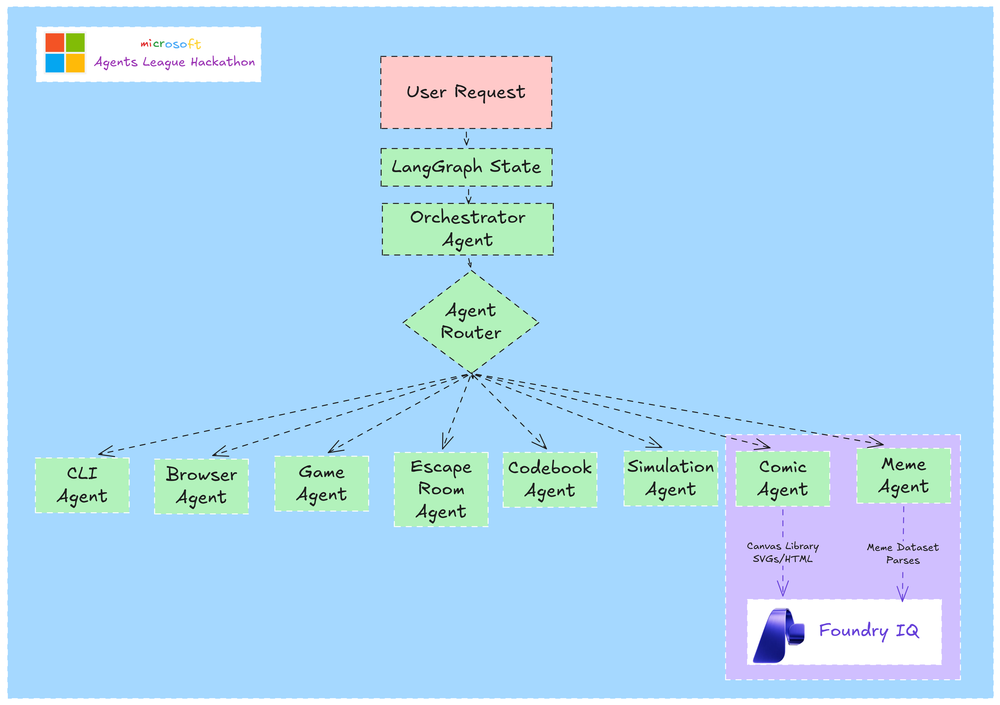
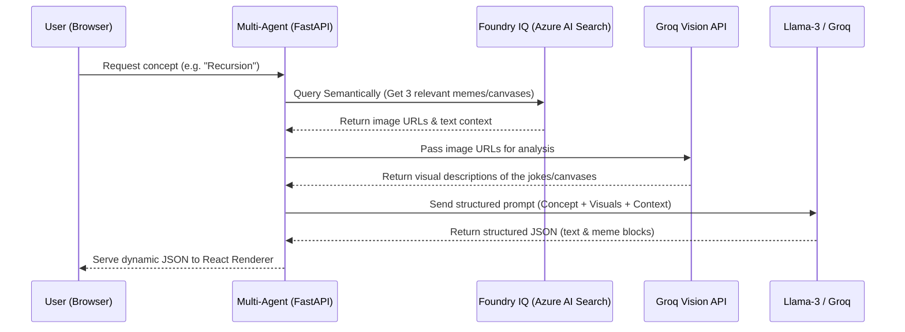
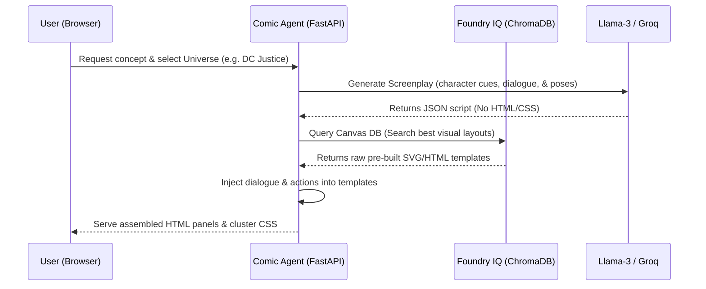

# KnowledgeForge Architecture

This document provides a detailed breakdown of the multi-agent architecture powering KnowledgeForge, outlining the flow from an initial user request down to the specialized generation agents.

## System Components

### 1. User Request
This is the entry point of the application. It represents the specific topic, concept, or query the user wants to learn about (e.g., "Explain Binary Search", "How does DNS work?").

### 2. LangGraph State
Upon receiving a user request, the system initializes a stateful context using **LangGraph**. This centralized state tracks the user's conceptual goal, extracted variables, selected educational mediums, and tracks the execution cycle. Unlike traditional stateless chat threads, this ensures continuity and contextual awareness throughout the generation process.

### 3. Orchestrator Agent
Acting as the central "brain" of the backend workflow, the Orchestrator Agent evaluates the `LangGraph State`. It analyzes the user's educational requirements and prepares the context to ensure the resulting interactive module perfectly aligns with pedagogical best practices.

### 4. Agent Router
The decision engine of the system. Based on semantic category rules and the nature of the concept, the Agent Router intelligently directs the workload to the most appropriate specialized agent. It answers the question: *What is the best medium to teach this specific concept?* 

### 5. Specialized Generation Agents
Once routed, one of the dedicated agents takes over to generate the highly-structured JSON data needed to render the interactive medium. The available agents include:
- **CLI Agent:** Formulates data for sandboxed terminal simulations, commands, and safe outputs.
- **Browser Agent:** Generates UI flows and parameters for simulated cloud consoles or browser dashboards.
- **Game Agent:** Constructs levels, mechanics, multiple-choice gates, and logical challenges for playable micro-games.
- **Escape Room Agent:** Designs text-based adventure logic, system terminal hints, and decryption puzzles.
- **Codebook Agent:** Creates step-by-step code execution scripts and data structure visualization states.
- **Simulation Agent:** Generates entities and parameters for system topology drag-and-drop exercises.
- **Comic Agent:** Writes educational storyboards, character dialogues, and visual cues to explain complex metaphors.
- **Meme Agent:** Crafts technical humor and narrative articles to reinforce memory retention.

### 6. Foundry IQ Layer
Highlighted as a distinct sub-system (the purple block in the diagram), Foundry IQ manages the visual compilation for visual-heavy agents (Comic and Meme Agents).
- **Canvas Library SVGs/HTML:** Provides predefined, pixel-perfect visual templates that the Comic Agent uses to structure its generated storyboards.
- **Meme Dataset Parses:** Curated visual layouts and datasets that the Meme Agent relies on for formatting technical humor.
- **Foundry IQ Engine:** A proprietary semantic compilation layer backed by Azure AI Search. It ensures that the generated text and dialogues map flawlessly onto the visual canvases, ensuring the final output is legible, visually consistent, and contextually accurate without relying on unpredictable image generation models.

## Deep Dive: Foundry IQ Integration

Here is a simple, clear breakdown of how the Meme Articles and Static Canvases interact with Foundry IQ (the database layer) to generate the experiences:

### 1. Meme Agent Workflow

**1. Retrieving from Foundry IQ (Database Layer)**
When you submit a concept, the Meme/Comic Agents query Foundry IQ (backed by Azure AI Search). It retrieves matching meme databases (`meme_db.py`) or layout assets (`comic_canvas_db.py`) based on semantic relevance to your concept.

**2. Vision AI Analysis (Groq Vision)**
To ensure the AI understands the visual joke, the retrieved meme image URLs are sent to the Groq Vision API (`meta-llama/llama-4-scout-17b-16e-instruct`). The vision model returns a text description of the image content (e.g., "A shocked cat staring at a computer monitor").

**3. Storytelling & Structured Compilation (The LLM)**
The agent feeds this visual description and the database context into the main LLM. The AI writes an educational, humorous article where the memes are smoothly woven into the paragraphs. It outputs a structured JSON schema:
- `type: "text"`: Sarcastic explanation paragraphs.
- `type: "meme"`: Image URLs, titles, and captions to display.

**4. Rendering in the UI**
The frontend React components (like `MemeRenderer.tsx`) receive the typed JSON. It maps the paragraphs, loads the static image URLs, and synchronizes with Text-to-Speech (TTS) to read the article aloud, highlighting the text block-by-block.

### 2. Comic Agent Workflow

**1. Screenplay Generation (The Script)**
When you choose a comic universe (e.g. DC Justice or Tom & Jerry), the Comic Agent sends the concept to the LLM. The LLM generates a strictly structured JSON script (screenplay) detailing:
- Which characters appear (e.g. Batman, Jerry) and their backgrounds.
- Their pose (thinking, pointing, action).
- The exact educational dialogue and action bubble text (e.g. "KAPOW!").

**2. Layout Retrieval from Foundry IQ**
To ensure perfect graphics and no code hallucinations, the agent never lets the LLM generate HTML or CSS. Instead, the backend queries the ChromaDB vector store using the script's `canvas_query` to find the best matching pre-built SVG/HTML panel layouts.

**3. Dynamic Panel Assembly**
The backend takes the retrieved SVG/HTML panel template and dynamically replaces placeholder tokens with the actual dialogue and actions:
- `{{DIALOGUE}}` is replaced by the character's educational speech.
- `{{ACTION}}` is replaced by the action impact text.

**4. Stylesheet Injection in Frontend**
The backend returns the finished HTML panels along with the matching stylesheet bundle (e.g., `dc_justice.css`). The frontend React app (`ComicRenderer.tsx`) injects the styling dynamically, renders the panels, and runs Speech Synthesis voices mapped to each character's gender and personality.
