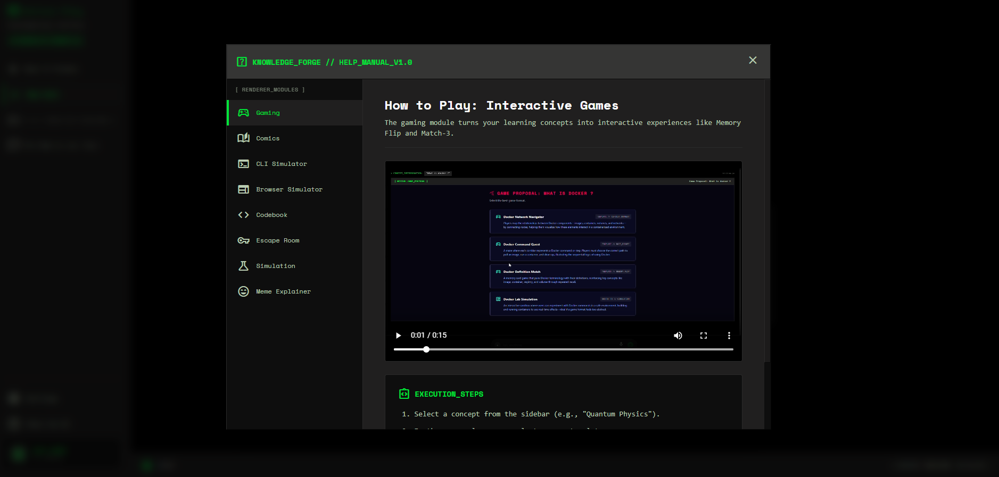

# KnowledgeForge Exploration Guidance

To experience the full power of the KnowledgeForge Multi-Agent AI Orchestrator, you can type specific types of questions or prompts into the system. The Orchestrator will automatically route your request to the best agent and medium. 

Here is a guide on **what to ask** to trigger **specific games, visualizers, and interactive features**.

## 🕹️ Interactive Games

| Feature | What to Ask / Example Prompts |
| :--- | :--- |
| **Catch & Drop** (Boolean/Classification) | "Which of these are valid HTTP methods?" "Identify frontend vs backend frameworks." |
| **Word Decode** (Vocabulary/Clues) | "Give me clues to guess common database terminologies." "Decode terms related to cybersecurity." |
| **Maze Escape** (Multiple Choice) | "Test my knowledge on Python syntax with a maze." "Let me navigate a maze by answering networking questions." |
| **Memory Flip** (Key-Value Matching) | "Match common network ports to their protocols." "Create a memory game for AWS services and their purposes." |
| **Sequence Sort** (Chronology/Steps) | "What are the stages of the CI/CD pipeline?" "Sort the steps of a standard Git workflow." |
| **Binary Jump** (True/False Platformer) | "True or False questions about JavaScript." "Platformer game testing my knowledge on Agile methodologies." |
| **Space Shooter** (Ordered Logic) | "Shoot the OSI model layers in the correct order." "Blast the steps of the TCP handshake in sequence." |
| **Circuit Connect** (Graphs/Networks) | "Connect the components of a microservices architecture." "Show me how a VPC network flow connects." |

## 📊 Algorithm Visualizers

Ask to "visualize" or "step through" specific data structures and algorithms.

| Visualizer | Example Prompts |
| :--- | :--- |
| **Array & Linked List** | "Visualize how items are inserted into a Linked List." |
| **Binary Tree & Search** | "Visualize a Binary Search Tree." "Show me how a Binary Search algorithm works step-by-step." |
| **Sorting Algorithms** | "Animate the Bubble Sort algorithm." "Show me a visual breakdown of Merge Sort." |
| **Heatmap & DP** | "Visualize dynamic programming with a heatmap." |
| **Graph** | "Show me Dijkstra's algorithm on a graph." |
| **Stack & Queue** | "Demonstrate push and pop operations on a Stack." |
| **Memory Address Space** | "Visualize stack pointers and heap allocation in memory." |
| **Hash Table** | "Show how collisions are handled in a Hash Table." |

## 🎭 Simulators, Comics & Narratives

| Feature | Example Prompts |
| :--- | :--- |
| **Sandboxed CLI Terminal** | "Teach me basic Linux file permission commands." "Let me practice Docker CLI commands." |
| **Browser Console Simulator** | "How do I configure an S3 bucket in AWS?" "Simulate creating a new virtual machine in Azure." |
| **System Topology** | "Let me drag and drop a highly available web architecture." "Map out a typical Kubernetes cluster topology." |
| **Comic Panel Screenplay** | "Explain OAuth authentication using DC Justice League characters." "Teach me about Garbage Collection using Tom & Jerry." |
| **Escape Room Adventure** | "I'm trapped in a compromised Linux server, help me escape using commands." |
| **Dynamic Meme Articles** | "Explain Recursion using internet memes." "Write a sarcastic, meme-filled article about debugging." |

## 💡 Pro-Tip
If you want to force a specific style, just mention it explicitly! E.g., *"Explain APIs as a Comic"* or *"Give me a Memory game for HTTP Status Codes"*.

## 📺 Need More Help?

For more help and a visual breakdown, check out the guide below:

